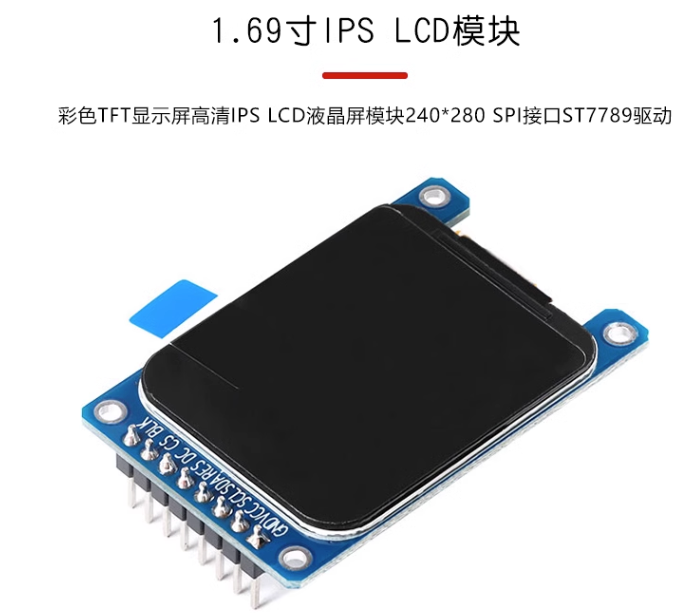

# LCD屏幕驱动代码



## 文件结构

LCD_240_280/Src/lcd_interface.c	包装SPI接口,初始化GPIO口

LCD_248_280/src/lcd.c	图像,文字显示函数

LCD_240_280/Inc/lcdfont.h	字模存储位置

LCD_240_280/Inc/pic.h	图像数组存储位置

## 使用演示

```c
#include "lcd.c"	//仅包含lcd.c文件即可

int main(void) {
    MX_SPI1_Init();		//先初始化SPI接口
    LCD_Init(WHITE);	//初始化屏幕,并填充白色作为底色
    
    LCD_ShowString(30,0,"Hello World",BLACK,WHITE,24,1);	//在(30,0)位置显示Hello World,黑色,24号字体
    while(1) {
        
    }
}
```